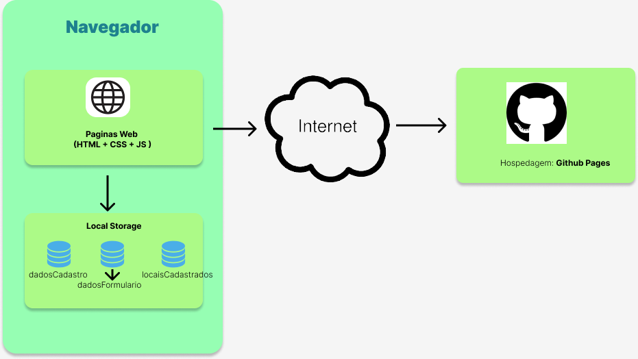

# Informações do Projeto

`iGO Tour`  

O projeto iGO Tour consiste na criação de uma aplicação web que ajuda os usuários a encontrar os locais turísticos ideais para visitar durante uma viagem. Muitas pessoas enfrentam essa dificuldade, e isso pode ser especialmente desafiador em destinos desconhecidos ou com culturas diferentes. Portanto, há uma necessidade de uma solução mais personalizada e eficiente para ajudar os viajantes a encontrar locais turísticos ideais em suas viagens. O tema escolhido é relevante e atual, e pode trazer soluções práticas para um problema comum.

&nbsp;

`CIÊNCIA DA COMPUTAÇÃO`

A Ciência da Computação é essencial na sociedade atual e requer que os profissionais se qualifiquem continuamente. Na PUC Minas, os alunos são incentivados a aplicar seus conhecimentos de forma inovadora e criativa, acompanhando o avanço do setor e participando de projetos de pesquisa orientados por professores qualificados para buscar novas soluções.

O projeto em questão está sendo desenvolvido por um grupo de alunos do 1º período para a disciplina "Trabalho Interdisciplinar I: Front-End", do curso de Ciência da Computação da PUC Minas Coração Eucarístico.

## Participantes

**Os membros do grupo são:**

- Arthur Araújo Nonato Silva
- Arthur Candian
- Guilherme Gomes De Brites
- Mateus Nunes Bello
- Matheus Pereira Gonsalves
- Paulo Henrique Lopes Ferreira
- Pedro Augusto Nunes Touriño

# Estrutura do Documento

- [Informações do Projeto](#informações-do-projeto)
  - [Participantes](#participantes)
- [Estrutura do Documento](#estrutura-do-documento)
- [Introdução](#introdução)
  - [Problema](#problema)
  - [Objetivos e Solução a partir da perspectiva do usuário](#objetivos-e-solução-a-partir-da-perspectiva-do-usuário)
  - [Justificativa](#justificativa)
  - [Público-Alvo](#público-alvo)
- [Especificações do Projeto](#especificações-do-projeto)
  - [Personas, Empatia e Proposta de Valor](#personas-empatia-e-proposta-de-valor)
  - [Histórias de Usuários](#histórias-de-usuários)
  - [Requisitos](#requisitos)
    - [Requisitos Funcionais](#requisitos-funcionais)
    - [Requisitos não Funcionais](#requisitos-não-funcionais)
  - [Restrições](#restrições)
- [Projeto de Interface](#projeto-de-interface)
  - [User Flow](#user-flow)
  - [Wireframes](#wireframes)
- [Metodologia](#metodologia)
  - [Divisão de Papéis](#divisão-de-papéis)
  - [Ferramentas](#ferramentas)
  - [Controle de Versão](#controle-de-versão)
- [**############## SPRINT 1 ACABA AQUI #############**](#-sprint-1-acaba-aqui-)
- [Projeto da Solução](#projeto-da-solução)
  - [Tecnologias Utilizadas](#tecnologias-utilizadas)
  - [Arquitetura da solução](#arquitetura-da-solução)
- [Avaliação da Aplicação](#avaliação-da-aplicação)
  - [Plano de Testes](#plano-de-testes)
  - [Ferramentas de Testes (Opcional)](#ferramentas-de-testes-opcional)
  - [Registros de Testes](#registros-de-testes)
- [Referências](#referências)

# Introdução

Os viajantes muitas vezes dependem de guias turísticos, aplicativos de viagem, sites de viagens e recomendações de amigos para obter informações sobre os melhores lugares para visitar. No entanto, essas fontes podem ser limitadas ou tendenciosas, o que pode levar a experiências turísticas insatisfatórias. Além disso, os viajantes podem ter preferências e necessidades específicas que não são consideradas nessas fontes de informação genéricas. Portanto, há uma necessidade de uma solução mais personalizada e eficiente que ajude os viajantes a encontrar locais turísticos ideais em suas viagens.

## Problema

Atualmente, muitas pessoas têm interesse em viajar e conhecer novos lugares, mas a dificuldade em encontrar locais turísticos ideais em uma viagem é um problema comum entre viajantes. Com a quantidade de informações disponíveis na internet muitas vezes é difícil filtrar e escolher entre tantas opções disponíveis, tornando a tarefa de pesquisa cansativa e muitas vezes desestimulante. Além disso, as informações encontradas podem ser genéricas ou incompletas, o que pode gerar insegurança e incerteza, dificultando a decisão de onde ir.

## Objetivos e Solução a partir da perspectiva do usuário

**Objetivo geral:**

O projeto consiste na criação de uma aplicação web que ajude o usuário a encontrar os locais ideais para ir durante sua viagem de forma fácil e eficiente. A aplicação irá fornecer sugestões e informações detalhadas sobre os locais adequados para cada tipo de pessoa, permitindo economizar tempo em pesquisas e fornecendo o necessário para que tomem decisões assertivas, com isso levando a experiências positivas durante sua viagem.

&nbsp;

**Objetivos específicos e Solução a partir da perspectiva do usuário:**

Para resolver o problema da dificuldade em encontrar locais turísticos ideais, a aplicação web irá oferecer as seguintes funcionalidades:

- Interface intuitiva e agradável para os usuários navegarem e encontrarem facilmente as informações desejadas;
- Disponibilizar informações detalhadas sobre os locais, incluindo atrações turísticas, gastronomia, baladas, etc;
- Permitir a pesquisa personalizada dos locais de acordo com as preferências do usuário;
- Permitir a avaliação e comentários dos usuários sobre as experiências nos locais, criando uma comunidade de compartilhamento de informações;
- Disponibilizar uma lista de desejos para os usuários salvarem os locais que desejam visitar durante a viagem;
- Disponibilizar uma lista de favoritos para os usuários salvarem os locais que gostaram de visitar;
- Garantir a responsividade da aplicação para que ela possa ser acessada em diferentes dispositivos, como desktops, tablets e smartphones;
- Integrar a aplicação com as redes sociais para que os usuários possam compartilhar locais e receber recomendações de amigos e familiares.

Com esses objetivos específicos, o projeto visa atender às necessidades dos usuários em relação à busca de locais turísticos e oferecer uma solução completa e eficiente para ajudá-los a encontrar os locais ideais onde ir em suas viagens.

## Justificativa

A aplicação web irá beneficiar tanto os viajantes quanto os prestadores de serviços turísticos. Para os viajantes, a aplicação irá facilitar a busca e a escolha do local ideal para visitar durante sua viagem, tornando a experiência de planejamento mais agradável e eficiente. Para os prestadores de serviços turísticos, a aplicação irá ajudar a divulgar seus serviços para um público mais amplo e segmentado.

## Público-Alvo

O público-alvo da aplicação são pessoas interessadas em viajar e conhecer novos lugares, que desejam encontrar locais turísticos ideais em uma viagem de forma fácil e eficiente. A aplicação também será útil para prestadores de serviços turísticos que desejam divulgar seus serviços para um público mais amplo.

# Especificações do Projeto

Para garantir a produtividade e avanço em um projeto, foram utilizadas diversas técnicas, incluindo a Matriz de Alinhamento CSD, Mapa de Stakeholders e a criação de personas para entender melhor o problema. Em seguida, foram criadas questões utilizadas em entrevistas para guiar as conversas com voluntários. Depois de entender o problema, foram utilizados métodos de Brainstorming e um template disponibilizado no Miro para organizar as ideias para a aplicação. A descrição detalhada das ferramentas utilizadas no processo, se encontra em [Ferramentas](#ferramentas).

## Personas, Empatia e Proposta de Valor

Foi criado um conjunto de três personas para ajudar a compreender melhor as necessidades e expectativas dos potenciais clientes da aplicação iGO Tour. Utilizando o template do Miro, cada persona foi detalhada com informações como idade, ocupação, interesses, problemas enfrentados e objetivos desejados. Essas personas fornecem uma compreensão mais clara sobre como a aplicação deve ser e quais utilidades devem ser oferecidas para atender às necessidades e expectativas dos clientes.

**Primeira persona e Proposta de Valor:**

&nbsp;

**Segunda persona e Proposta de valor:**

&nbsp;

**Terceira persona e Proposta de valor:**

## Histórias de Usuários

Com base na análise das personas foram identificadas as seguintes histórias de usuários:

| EU COMO... `PERSONA`                             | QUERO/PRECISO ... `FUNCIONALIDADE`                                                                                                                                                                              | PARA ... `MOTIVO/VALOR`                                                                           |
|--------------------------------------------------|-----------------------------------------------------------------------------------------------------------------------------------------------------------------------------------------------------------------|---------------------------------------------------------------------------------------------------|
| Viajante                                         | Encontrar locais turísticos que atendam às minhas preferências pessoais, como atividades ao ar livre, restaurantes veganos e museus de arte                                                                     | Que eu possa aproveitar minha viagem ao máximo e não perca tempo em lugares que não me interessam |
| Viajante que está viajando com crianças          | Sugestões de locais turísticos familiares e seguros que possam entreter as crianças                                                                                                                             | Que possamos desfrutar de nossa viagem juntos                                                     |
| Viajante que está interessado em culinária local | Receber recomendações de locais turísticos gastronômicos e autênticos                                                                                                                                           | Que eu possa experimentar a comida local e mergulhar na cultura do lugar                          |
| Viajante que deseja fugir das multidões          | Encontrar locais turísticos menos conhecidos, recebendo sugestões de locais turísticos fora do circuito turístico convencional                                                                                  | Que eu possa desfrutar de uma experiência autêntica e única                                       |
| Viajante a negócios                              | Um site de viagens que possa me fornecer informações sobre locais turísticos próximos ao meu local de trabalho                                                                                                  | Que eu possa aproveitar meu tempo livre ao máximo                                                 |
| Viajante com orçamento limitado                  | Uma maneira de encontrar locais turísticos econômicos e acessíveis                                                                                                                                              | Que eu possa desfrutar de minha viagem sem gastar muito dinheiro                                  |
| Turista                                          | Receber sugestões personalizadas de locais turísticos com base em meus interesses e histórico de viagens anteriores                                                                                             | Que eu possa descobrir novos lugares que possam me interessar                                     |
| Turista                                          | Ter acesso a informações atualizadas e precisas sobre os locais turísticos que pretendo visitar, incluindo horários de funcionamento, preços de ingressos, opções de transporte e outras informações relevantes | Que eu possa planejar minha viagem com antecedência                                               |
| Turista em uma cidade desconhecida               | Um aplicativo de navegação que possa me guiar até os locais turísticos populares e menos conhecidos                                                                                                             | Que eu possa aproveitar ao máximo minha visita e evitar me perder                                 |
| Turista em uma cidade desconhecida               | Usar um mapa interativo que mostre locais turísticos                                                                                                                                                            | Que eu possa facilmente encontrar e visitar esses locais                                          |
| Turista em um país estrangeiro                   | Acessar informações sobre locais turísticos com base em avaliações e comentários de outros turistas                                                                                                             | Que eu possa ter uma ideia mais precisa do que esperar antes de visitar esses lugares             |

## Requisitos

As tabelas que se seguem apresentam os requisitos funcionais e não funcionais que detalham o escopo do projeto.

### Requisitos Funcionais

| ID     | Descrição do Requisito                                                                                                                     | Prioridade |
|--------|--------------------------------------------------------------------------------------------------------------------------------------------|------------|
| RF-001 | Permitir que os usuários pesquisem por locais turísticos com base em suas preferências, como tipo de atividade, preço, localização, etc    | ALTA       |
| RF-002 | Permitir aos usuários criar um perfil e salvar suas preferências e históricos de viagens anteriores para receber sugestões personalizadas  | ALTA       |
| RF-003 | Apresentar locais turísticos em um mapa interativo, permitindo que os usuários planejem rotas entre eles                                   | MÉDIA      |
| RF-004 | Permitir filtrar locais turísticos com base nas necessidades especiais dos usuários, como acessibilidade e opções de alimentação adequadas | ALTA       |
| RF-005 | Permitir que os usuários classifiquem e comentem sobre locais turísticos                                                                   | ALTA       |
| RF-006 | Apresentar informações precisas e atualizadas sobre locais turísticos em vários idiomas                                                    | MÉDIA      |
| RF-007 | Permitir que os usuários reservem ingressos e agendem visitas a locais turísticos diretamente pelo aplicativo                              | BAIXA      |
| RF-008 | Permitir que os usuários salvem locais turísticos em uma lista de favoritos para referência futura                                         | MÉDIA      |
| RF-009 | Permitir que os usuários adicionem pessoas em uma lista de amigos para compartilharem locais e informações                                 | BAIXA      |
| RF-010 | Permitir que os usuários compartilhem informações e avaliações sobre locais turísticos em suas redes sociais                               | MÉDIA      |
| RF-011 | Permitir aos usuários criar um roteiro com os locais que deseja visitar durante sua viagem                                                 | MÉDIA      |

### Requisitos não Funcionais

| ID      | Descrição do Requisito                                                                                                                                | Prioridade |
|---------|-------------------------------------------------------------------------------------------------------------------------------------------------------|------------|
| RNF-001 | Interface de usuário intuitiva e fácil de usar, para que os usuários possam navegar e pesquisar locais turísticos sem problemas                       | ALTA       |
| RNF-002 | Acessível em diferentes dispositivos, incluindo smartphones, tablets e desktops, para que os usuários possam acessá-lo de forma conveniente           | ALTA       |
| RNF-003 | Tempos de resposta rápidos e confiáveis, para que os usuários possam obter informações atualizadas e relevantes sobre locais turísticos em tempo real | MÉDIA      |
| RNF-004 | Seguro e protegido, garantindo a privacidade dos usuários e protegendo as informações pessoais e financeiras compartilhadas no sistema                | ALTA       |
| RNF-005 | Recursos de localização precisos, para que os usuários possam encontrar facilmente locais turísticos em sua área                                      | ALTA       |
| RNF-006 | Sistema escalável e capaz de lidar com um grande número de usuários simultaneamente, especialmente em períodos de pico, como feriados e férias        | BAIXA      |
| RNF-007 | Fácil integração com outros aplicativos e serviços de viagem, para que os usuários possam planejar sua viagem de forma mais eficiente e conveniente   | MÉDIA      |
| RNF-008 | Alto grau de confiabilidade, para que os usuários possam confiar nas informações fornecidas e ter uma experiência de viagem positiva e satisfatória   | ALTA       |

## Restrições

O projeto está restrito pelos itens apresentados na tabela a seguir.

| ID | Restrição                                                               |
|----|-------------------------------------------------------------------------|
| 01 | O projeto deverá ser entregue até o final do semestre                   |
| 02 | Não pode ser desenvolvido um módulo de backend                          |
| 03 | Falta de recursos para integração com pretadores de serviços turísticos |
| 04 | O projeto deve utilizar apenas HTML, CSS, JS                            |
| 05 | A evolução do projeto deve ser feita em reunião                         |

# Projeto de Interface

O foco é na qualidade da interface do usuário, que deve ser limpa, minimalista e funcional para fortalecer a identidade visual e tornar a aplicação fácil e intuitiva de usar, aumentando sua fixabilidade na rotina dos usuários.

## User Flow

O diagrama representa o fluxo de usuário na aplicação que começa com uma tela de login e, em seguida, apresenta uma visão geral simples do aplicativo.

## Wireframes

De acordo com o userflow apresentado acima, a aplicação terá uma tela de login, Sign-In, Home com filtros de busca, Serviços, Quem somos e contato.

Para visualizar o wireframe pelo aplicativo do figma, acesse: <https://www.figma.com/file/zApQI8EVjmSkYG7bxHGZuR/Untitled?node-id=0-1&t=dYew46wqPn4jG0sR-0>

**1 - Login**

**2 - Sign-in**

**3 - Home**

**4 - Home + busca**

**5 - Cadastro de locais**

**6 - Visualização dos locais**

**7 - Exploraração do estabelecimento + Registro de avaliações**

**8 - Ver avaliações**

# Metodologia

A metodologia que usamos contemplou o uso de diversas ferramentas de trabalho para assim uma melhor diversificação de funcões no grupo. Foram utilizados:

Github para o controle de versão e repositório de código, metodologia, documentação e tudo aquilo que for feito no projeto.

Utilizamos o google forms para fazer uma entrevista com o nosso público-alvo, tendo juntamente a isto a entrevista presencial para uma melhor qualidade de resultados

O Miro foi utilizado para criar e discutir todo o processo de design thinking, todo este foi feito em maior parte presencialmente com todos do grupo e escrito em conjunto atraves da discussão de ideias e análise qualitativa das entrevistas, tanto as realizadas pessoalmente quanto aquelas quantitativas feitas pelo forms

Usamos o Figma para construir o userflow baseado nas ideias discutidas e concluídas através do Miro (persona e processo de design thinking) e tentar implementá-las de maneira funcional no site. Junto a isto no Figma também foi construido o Wireframe do projeto para servir como base para a construção do template do site.

Durante todo o projeto também foi utilizado um grupo no discord para termos controle da divisão de tarefas e divisão de funções, estas cujo quais ficaram muito bem definidas sendo um membro líder de cada parte do projeto para guiar e delegar as funções relacionadas a sua parte para os outros membros do grupo.

Decidimos além disto utilizar o VSCode para editar o código do programa e a ferramenta Trello para fazer a divisão de tarefas que será realizada durante a criação do código do site.

## Divisão de Papéis

Além das funções pré-definidas abaixo, todos os membros do grupo participaram da elaboração de determinadas partes do projeto, como o Miro, e algumas participaram de outras pequenas partes, fora das suas específicas.

- Guilherme de Brites - Apresentação slides
- Matheus Pereira e Arthur Candian - Figma
- Pedro Touriño e Mateus Bello - Documentação
- Arthur Nonato e Paulo Henrique - Pesquisa de campo

## Ferramentas

Assim como explicado acima, abaixo se encontram os links das ferramentas utilizadas juntamente com o link do nosso projeto dentro delas:

| Ambiente  | Plataforma              |Link de Acesso |
|-----------|-------------------------|---------------|
| Processo de Design Thinkgin | Miro | <https://miro.com/app/board/uXjVMYDTrNk=> |
| Repositório de código | GitHub | <https://github.com/ICEI-PUC-Minas-PMGCC-TI/ti-1-pmg-cc-m-20231-tiaw-turismo-2> |
| Protótipo | Figma | <https://www.figma.com/file/zApQI8EVjmSkYG7bxHGZuR/Untitled?node-id=45%3A148&t=gW29rYDs9WVoaoSV-1> |
| Criação de paleta de cores | Adobe Color | <https://color.adobe.com/pt> |
| Editor de código | VSCode | <https://code.visualstudio.com> |
| Comunicação entre o grupo | Discord | <https://discord.gg/4NtB7n7q> |
| Divisão de tarefas | Trello | <https://trello.com/b/b7dEVeEp/kanban-ti-1-projeto-fr> |

## Controle de Versão

O site vai ser divido em versões que utilizarão 3 dígitos, sendo estes:

1 - Atualização master

2 - Atualização parcial estável

3 - Atualização de bugfix ou atualização de código sem implementação visual

Exemplo:

2.5.1

2 = Segunda grande implementação estável

.5 = Quinta parte de implementação parcial, mas ainda não caracteriza uma mudança significativa

.1 = Bugs corrigidos

Utilizaremos também algumas tags para o desenvolvimento:

`master`: versão estável já testada do software

`unstable`: versão já testada do software, porém instável

`testing`: versão em testes do software

`dev`: versão de desenvolvimento do software

`bugfix`: uma funcionalidade encontra-se com problemas

`enhancement`: uma funcionalidade precisa ser melhorada

`feature`: uma nova funcionalidade precisa ser introduzida

`description`: uma melhoria no sistema de comentarios do codigo

`root`: uma modificação na base do sistema

`branch`: uma modificação que nao modifica outras partes do sistema

# **############## SPRINT 1 ACABA AQUI #############**

# Projeto da Solução

Como dito anteriormente, a falta de informações pode acabar prejudicando a escolha e experiência das pessoas em suas
viagens. Nossa solução se dá em oferecer as informações de maneiras simples e diretas aos usuários que buscam realizar viagens. Disponibilizamos ao usuário, com uma interface intuitiva, uma forma mais simples e eficiente de conseguir satisfazer seus gostos pessoais e poder ter viagens mais divertidas, interativas e que possam ser melhor aproveitadas de acordo com suas condições financeiras.

## Tecnologias Utilizadas

> As tecnologias utilizadas para desenvolvimento foram HTML, CSS, JavaScript e Bootstrap.
> Outras tecnologias utilizadas para gerenciamento foram Git, GitHub, Miro, Visual Studio Code e Figma,
>

## Arquitetura da solução

Em seguida está disponibilizado em a imagem do diagrama do projeto web desenvolvido.
>
>Navegador: possui os documentos em HTML, CSS, JavaScript e os dados JSON em localStorage.
>Internet: A aplicação está hospedada no Github Pages.
> 

# Avaliação da Aplicação

> - 1.Cadastro de conta do usuário.
> - 2.Registro de login de usuário.
> - 3.Registro de estabelecimentos para visitar.
> - 4.Registro de avaliações de usuário.
> - 5.Filtro de pesquisa.
> - 6.Exibição das avaliações de estabelecimentos.
> - 7.Retorno de locais.
> - 8. Exclusão de locais.

## Plano de Testes

1. Cadastro de conta do usuário:
- Permite ao cliente criar sua conta e acessar o login.

2.Registro de login de usuário:
- Cliente poderá acessar o site e desfrutar das funcionalidades que requerem login.

3. Registo de estabelecimentos para visitar:
- Funcionalidade voltado aos administradores para permitir realizar o cadastro de novos locais para frequentar.

4. Registro de avaliações do usuário:
- Capacidade dos usuário de registrar a sua experiência pessoal com o local frequentado.

5. Filtro de pesquisa:
- Funcionalidade essencial para permitir que o usuário possa filtrar suas buscas e retornar os locais de interesse específicos.

6. Exibição das avaliações dos estabelecimentos>
- Permite que outros usuários possam visualizar avaliações e experiências registradas por clientes anteriores.

7. Retorno de locais:
- Funcionalidade que retorna tanto no filtro de busca personalizado, e também no registro geral dos locais cadastrados.

8. Exclusão de locais:
- Permite que os administradores possam excluir estabelecimentos do sistema.

## Registros de Testes

> Os testes foram bem sucedidos, as funcionalidades foram testadas manualmente, tendo sido utilizado o console log para obter o retorno dos parâmetros desejados.

# Referências

> O projeto foi desenvolvido do zero, sem a utilização de muitas tecnologias. 
>
> **Links Úteis**:
>
> - [Bootstrap](https://getbootstrap.com/docs/5.0/getting-started/introduction/)

